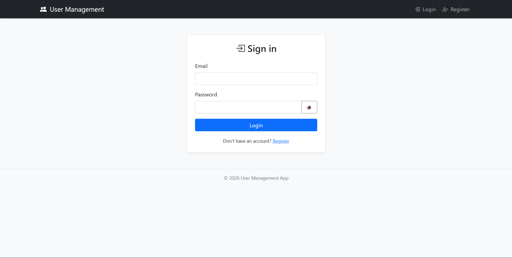
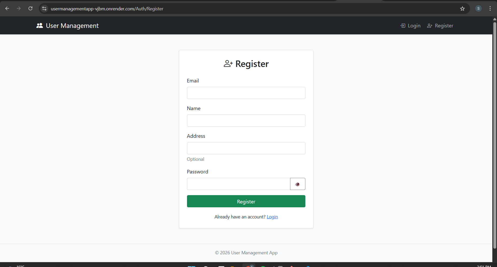
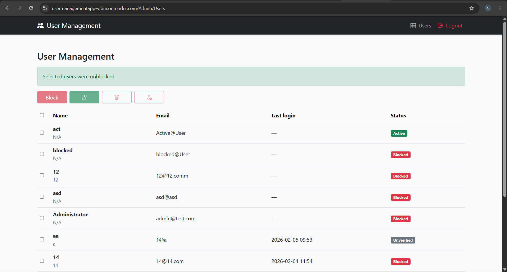

# UserManagementApp

A web-based **User Management System** built with **ASP.NET** that provides authentication, authorization, and full user administration capabilities. The application supports login, registration, and management of users through a clean and practical interface.

## 🚀 Live Demo

👉 [https://usermanagementapp-vjbm.onrender.com/](https://usermanagementapp-vjbm.onrender.com/)

## 📂 Source Code

👉 [https://github.com/Eessketit/UserManagementApp](https://github.com/Eessketit/UserManagementApp)

---

## ✨ Features

* 🔐 User registration and login
* 👤 User management (view, edit, delete users)
* 🚫 Ability to block or delete users
* 🔑 Simple password rules (any non-empty password allowed)
* 📧 Email verification **not required** for login
* 🗑️ Users are **permanently deleted** (not soft-deleted)
* 🌐 Web-based UI

---

## 🛠️ Tech Stack

* **Backend:** ASP.NET
* **Frontend:** HTML, CSS (Bootstrap)
* **Database:** PostgreSQL
* **ORM:** Entity Framework Core
* **Authentication:** ASP.NET Identity
* **Hosting:** Render

---

## 📸 Screenshots


### Login Page


### Registration Page


### Management Page



---

## ⚙️ Installation & Setup

### Prerequisites

* .NET SDK
* PostgreSQL
* Git

### Steps

1. Clone the repository

   ```bash
   git clone https://github.com/Eessketit/UserManagementApp.git
   ```

2. Navigate to the project folder

   ```bash
   cd UserManagementApp
   ```

3. Configure the database connection string in `appsettings.json`

4. Apply migrations

   ```bash
   dotnet ef database update
   ```

5. Run the application

   ```bash
   dotnet run
   ```

6. Open in browser

   ```
   http://localhost:5000
   ```

---

## 📄 Project Requirements (Implemented)

* Use of a CSS framework (Bootstrap)
* Users can manage (block/delete) themselves or others
* No password complexity restrictions
* Login allowed without email verification
* Hard delete for users
* Immediate registration confirmation message

---

## 📌 Future Improvements

* Role-based access control (Admin/User)
* Password hashing policies & security improvements
* UI/UX enhancements
* Pagination and search for users
* Audit logs

---

## 👨‍💻 Author

**Shohruz**
GitHub: [https://github.com/Eessketit](https://github.com/Eessketit)

---

## 📜 License

This project is for educational purposes. You are free to use and modify it.
